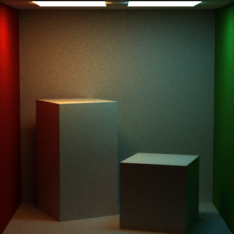
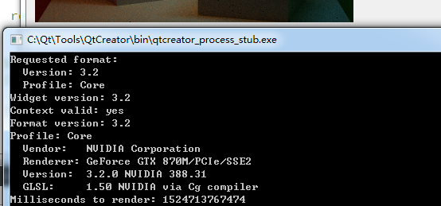
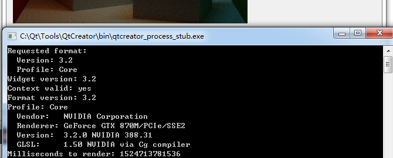
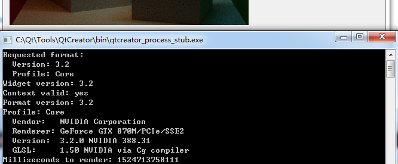

# CIS_461_HW7

## Full Lighting 2 Lights ##

This is the final result for full lighting. 
The Russian Rullete is included. 

## Full Lighting WITHOUT Russian Rullete ##

Since Russian Rullete may ignore some "possible details", it is disabled here to test if the result cound be somewhat better. 
Compare it with the upper one, sadly it is not any better. 

## Time Costs

This is the time costed with Russian Rullete. 

This is the time costed without Russian Rullete. You can see that it is 14 sec slower. 

I noticed that in multi thread looping, "break" is slower than "return".
Since in FullLightIntrgrator, anyway we are returning L...and there's no operations after the big for loop.
So, why not just return when the break critiria is met?
As you can see, it is 18 sec faster than the first result(with Russian Rullete).
